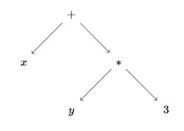
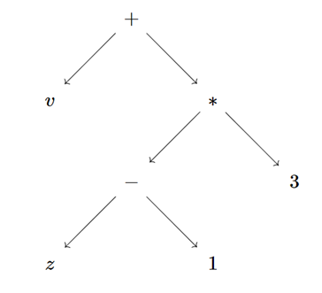
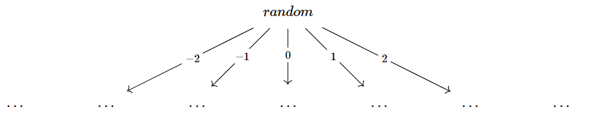
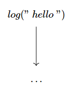
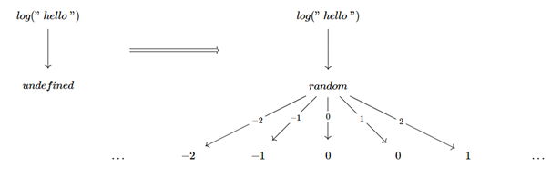

Some time ago I wrote a [series about Algebraic effects](/2018-11-19-algebraic-effects-series-1). I explained then that you could either explain the topic using Math concepts (Denotational) or by showing how it works under some runtime environment like JavaScript (Operational). I choose the second way because I felt it would've been more approachable to programmers, and also because I didn't have myself enough understanding of the Mathematical theory behind them.

In retrospect, I think there is a simple way to put the denotational explanation without brining in the heavy math formalism. IMO this alternative view is better and simpler than the four lengthy posts I wrote back then. It also explains what Algebra has to do with side effects in programming.

# Algebras: Specification, Construction & Evalution

Let's start from simple algebraic expressions like `x + 2`, `x + (y * 3)` ... We construct such expressions by combining variables and constants using **operations** like `+` or `*`. We can envision those expressions as trees branching at each operation, with variables and constants at the leaves.



To evaluate an expression, we need to assign values for the variables. In a program, we could have a function `evaluate(bindings, expr)` which computes the value of `expr`, given an object that **bind**s each variable in the expression to a concrete number.

But we could go a little further and allow bindings to assign other sub-expressions to variables. For example, evaluating `x + (y * 3)` with a binding like `{ x : v, y: z - 1}` would substitute all occurrences of `x` and `y` to produce `v + ((z - 1) * 3)`. Visually, it'll look like we grew the tree by inserting new sub-expressions at the leaves



## Specification

Mathematicians have a nasty obssession for abstractions. For instance, instead of talking about adding 2 integers, they would abstract away some common properties, like the fact that addition is associative (`x + (y + z) = (x + y) + z`) and then define a sort of abstract interface (for associativity, they call it a _Semigroup_). Any Set with an operation that satisfies the above equation could be considered an instance of that interface.

There is a whole catalogue of those _Algebraic structures_ that are studied in the field of Abstract Algebra. But we're not interested in them. What's important to us is, like the separation interface/class, we distill the process: first we define of a bunch of abstract operations in terms of some _equations_ that must be satisfied, and then pick a concrete Set together with some functions that implement the specified operations in a way that satisfies the required equations (e.g. integers and integer addition, or strings and concatenation).

The abstract operations and their equational laws can be grouped together under what's called an _Algebraic Theory_, that's the interface. A concrete Set together with functions that interpret all operations is called a _Model_ for the specific Algebraic Theory, that's the implementation. As you might expect, there is also a special name for the concrete Set used by the model: it's called the _carrier_ of the model.

For example, we can describe the theory of a Monoid through 2 operations, `zero` and `add`

```ts
// We're just specifying the operations, no equational laws
interface Monoid<A> {
  zero(): A
  add(left: A, right: A): A
}

// Model using `number` as carrier
const MNum: Monoid<number> = {
  zero: () => 0,
  add(left: number, right: number): number {
    return left + right
  },
}
```

## Construction

One thing you will not find in the interface/class analogy is that there is a systematic way to construct an implementation for each interface (i.e. a Model for each Algebraic Theory). It's really simple, pick any Set, then for each operation, just take the given information _as is_ and keep it.

For instance instead of interpreting the expression `2 + 3` as `5` (losing the _initial information_ about `2` and `3` in the process), we can construct _an expression tree_ (with integers in the leaves) for our Model. Think of it as constructing an Abstract Syntax Tree (AST) without any further evaluation (we also use equational laws to group trees under equivalent classes but that's not important for us).

And yes, those trees have also got a special name, they are called _Free Models_.

For example, to construct the free model for Monoids, we could write someting like

```ts
// we'll use a label `pure` to inject values in the leaves
type MTree<A> =
  | { tag: "pure"; value: A }
  | { tag: "zero" }
  | { tag: "add"; left: MTree<A>; right: MTree<A> }

function pure<A>(value: A): MTree<A> {
  return { tag: "pure", value }
}

function zero<A>(): MTree<A> {
  return { tag: "zero" }
}

function add<A>(left: MTree<A>, right: MTree<A>): MTree<A> {
  return { tag: "add", left, right }
}

// No evaluation, just collecting information
let expr = add(pure(10), add(pure(100), zero()))
```

## Evaluation

To evaluate expression trees, we can write a function that goes recursively over the tree. But we can write a general purpose function that constructs a tree evaluator from any given model.

```ts
function fold<A>(model: Monoid<A>) {
  return function evaluate(tree: MTree<A>): A {
    if (tree.tag === "pure") return tree.value
    if (tree.tag === "zero") return model.zero()
    else return model.add(evaluate(tree.left), evaluate(tree.right))
  }
}

const interpreter = fold({
  zero: () => 0,
  add(left: number, right: number): number {
    return left + right
  },
})

console.log("result", interpreter(expr))
```

Observe how we've abstracted away recursion from the model and encapsulated it inside `fold`. Thr Model had only to provide a _shallow_ interpreter for the operations. We'll see a similar behavior when taking about Handlers for Algebraic Effects.

> In fact `fold` is very similar to the `reduce` method of JavaScript arrays. If you think of Array as an algebraic theory with a pair of operations `[]` and `[head, ...tail]`, then a model has to provide 2 functions: the first simply selects an element for the case of `[]` (the second paramater of `reduce`), and the second combines `head` and `tail` (the first parameter of `reduce`). Semantically, `reduce` acts like a `fold` specialized to arrays.

# Programs

There are various mental models to envision a program. The idiomatic, the most evident, is to imagine a series of successive steps. In this model, the program invokes commands that gets interpreted by some machine. After each command, the machine would transition from a state to another. We can charachterize this point of view as imperative, and it's often made formal by computer scientists using some sort of state machine.

But there is also a declarative point of view, we can imagine a program as one big expression. The expression is handed as a tree to an interpreter that then chooses a suitable evlaluation for the operations (like integer addition for `+` etc).

One could object that the above could only work in the case of simple mathematical expressions, or using the programming language jargon, in the case of **pure expressions**. For example, how would `console.log` or `fetch` look like in a tree?

More generally, the question is: how do we get a tree-like representation of **side effects**. And since we saw earlier that our trees are just free models of algebraic theories, the question translates to: could we have an algebraic representation of side effects?

We saw that algebraic expressions are constructed by operations that combine other sub expressions. Let's observe that every operation can take a fixed number of arguments. Common arithmetic operations like `+` or `*` are generally binary (taking 2 arguments), but that's not mandatory, for `-3` we can view `-` as an unary operation (taking a single argument). The number of arguments an operation takes is called its **arity**.

In order to fit side effects in this picture, we need to adopt a wider view of the concept of arity. Let's take for example the side effect of getting a random value from the environement (like `Math.random()` in JavaScript). The imperative view represents the side effect as an action which would modify the external world then returns a value. The program would then continue in the _new version_ of the world.

We could represent the effect with a `random` operation, but this time with a kind of an **infinite arity**. For example, say `random` returns only arbitrary integers, then the arity would be the number of all integers. Visually we'll have a tree with the `random` operation at its root, and a branch for each possible answer that can be returned by the operation



Another example `console.log` can be seen as a function taking the message to log and returning a (parameterized) `log` operation. What's its arity? think about it this way: in the case `random` there could be, potentially, as many ways to continue the program as there are possible answer values. But since`log` returns a unique meaningless value (e.g. `undefined`) then there could be only one way to continue the program (simply the code after `console.log`).



One more example, `throw` could be seen as a function taking the error to be thrown and returning an `abort` operation. How many ways are there for the program to continue after `abort`? None! It's a dead end, so the arity of `abort` is `0` (of course the program could possibly continue with an exception handler, but that's the other side of the story).

we need one last generalisation of the arity concept. For instance, in order to represent the `random` program above in code, we'd have to provide an argument for each possible answer, something like

```js
random(...[rest if -1], [rest if 0], [rest if 1], ...)
```

But it's impossible. Fortunately there is a feasible formulation

```js
random(n => {
  // return children depending on `n`
  // ...
})
```

Sometimes the simplest solution is a function.

In this setting, a function acts like a dictionary whose size is exactly that of the possible answers expected from the operation. More formally, if `integer` is the type of integer expressions in our programming language, then w'd say that `random` has an arity of `integer`.

Observe also that the equivalence is general, a binary operation `add(x,y)` can also be written `add(b => b ? x : y)` and we could also say that `add` has a `boolean` arity (note that we're not adding/evaluating anything here, we're just constructing the tree that represents the expression).

There is nothing fancy here, from a programming point of view, the function passed to the operation is just a _continuation_ that takes the answer from the performed operation and return the rest of the program. It turns out that the continuation is a general representation for tuples of any arity.

In our earlier implemetation of simple Monoid expessions, we used interfaces to represent operations. And this is the way to go for all operations provided we have a sufficiently powerful type system to track side effects. In the rest I'll just use a generic operation object.

More specifically, a program can be either

- a Leaf : a pure value, code doesn't perform any operation or side effect
- a Subtree: an Operation together with a continuation that specifies the subtree's children or the rest of the computation

In typescript this would be something like

```ts
type Program<A> =
  | { tag: "pure"; value: A }
  | {
      tag: "operation"
      name: string
      params: Array<any>
      resume: (x: any) => Program<A>
    }
```

> Observe we use `any` for the type of arity. We need a feature called _existential types_ in order to have a more typesafe signature. We also store the parameters that were passed to the operation.

In the rest I'll use just Javascript. We'll represent leaves as plain javascript expressions, and operations with a special object type

```js
const id = x => x

function operation(name, params = [], resume = id) {
  return { _IS_OPERATION_: true, name, params, resume }
}
```

for example

```js
const random = operation("random")
// { _IS_OPERATION_: true, name: "random", params: [], resume: id }

function log(message) {
  return operation("log", [message])
}
log("hello")
// { _IS_OPERATION_: true, name: "log", params: ["hello"], resume: id }
```

Obviously we can't write entire programs in one hard-coded giant expression tree. Observe that the `resume` parameter already defaults to the identity function, which means that by default the program performs the operation then returns the answer provided by the external environment.

The default identity continuation allows us to create small _truncated_ programs. what we need is a way to assemble bigger programs (trees) from smaller programs (subtrees). We can acheive this by exploiting the _binding_ operation we saw earlier with simple math expressions. Binding will allow us to extend the program tree by replacing leaves (i.e. pure values) with further subtrees (rest of the program).

```js
function bind(program, then) {
  if (!program?._IS_OPERATION_) {
    return then(program)
  } else {
    let { name, params, resume } = program
    return operation(name, params, a => bind(resume(a), then))
  }
}
```

`bind` takes a subprogram and a continuation. If the subprogram is a leaf/pure value, we apply the contiuation immediately to get the rest of the program. This corresponds to 'substitute a leaf with a subtree' case. Otherwise we need to call `bind` recursively on all subtrees (the `a => bind(resume(a), then)`, think of `resume` as a big dictionary: Each entry `{a: resume(a)}` in the dictionary is replaced by `{a: bind(resume(a), then)}`).

For example, going from `log("hello")` to `bind(log("hello"), _ => random)` could be visually represented as



One more caveat is that writing programs using nested `bind`s is akin to writing in continuation passing style, which is tedious and impractical.

First, let me clarify that the above implementation is just intented as a pedagogical tool. A real implementation of algebraic effects would typically be backed by a programming language, not only to provide an ergonomic way to write programs, but also to generate an efficient executable.

But still, we'd have to see how our tree representation maps to a traditional code written in a seqeuntial way. In the case of JavaScript, we can use Generator functions to create and bind programs using the sequential style. So for example one would write

```js
function* fetchData() {
  let user = yield fetchUser
  let repos = yield fetchRepos
  return { user, repos }
}
```

instead of

```js
bind(fetchUser, user => {
  return bind(fetchRepos, repos => {
    return { user, repos }
  })
})
```

Below a simple (and ineffecient) implementation for transforming Generator functions into `bind` expressions, I won't be commenting the code because the post is already getting long. The code supports resuming the `bind` continuation multiple times (which means the computation can take many paths in the tree).

```js
function go(gf, args = [], history = []) {
  let gen = gf(...args)
  let res = history.reduce((_, x) => gen.next(x), gen.next())
  if (res.done) return res.value
  else {
    return bind(res.value, x => go(gf, args, history.concat(x)))
  }
}

const program = go(fetchData)
// // { _IS_OPERATION_: true, name: "fetchUser", params: [], resume: ... }
```

We've talked about construction, but what about evaluation? That where handlers fit in the story. Operationally, handlers are presented as a generalisation of exception handlers that can resume the program from the point that threw the exception.

In our declarative representation, a handlers is just another expression evaluator, like the one we saw earlier for Monoids.

Let's recall how we implemented the interpreter for our earlier Monoid theory. Given any Model for the Monoid theory, `fold` generates an interpreter for a monoid tree (the free model)

```js
function fold<A>(model: Monoid<A>) {
  return function evaluate(tree: MTree<A>): A {
    if (tree.tag === "pure") return tree.value
    if (tree.tag === "zero") return model.zero()
    else return model.add(evaluate(tree.left), evaluate(tree.right))
  }
}

const interpreter = fold({
  zero: () => 0,
  add(left: number, right: number): number {
    return left + right
  },
})
```

`fold` first handles the `pure` case by returning the pure value (i.e. carrier value). Then for each operation, we start by recursively evaluating its children, then we use the model to recombine the computed values.

Our programs are just expressions with a general notion of arity for the operations. So we can take the same implementation and adapt it.

```js
function handler(model) {
  return function evaluate(tree) {
    if (!tree?._IS_OPERATION_) return h.return ? h.return(tree) : tree
    let { name, params, resume } = tree
    if (name in model) {
      return model[name](...params.concat(x => evaluate(resume(x))))
    }
    return operation(name, params, x => evaluate(resume(x)))
  }
}
```

In our new interface, we're dealing with generic operations, so we need to pass the operation's parameters to the model. The model gets also a continuation representing the rest of the program (or the operation's children). Just like `fold`, `handler` calls the evaluator recursively on the operations's children (all `x => evaluate(resume(x))` calls).

We're also adding another clause, if our model doesn't handle the current operation, then we _bubble_ it up to upstream handlers. But in the meantime, the handler wraps itself around the operation. In the tree language, the model just ignores the operation node and tries to evaluate all its children instead.

Finally, we allow the model to preprocess the return value of the program (the leaves) using a special method `return`. This is needed to allow the handler to change the return value of a program (like a handler for a program performing `state` effects can return stateful functions `state -> [value, state]`).

To highlight the analogy, here's a reimplementation of Monoids using the new generic interface

```js
function zero() {
  return operation("zero")
}

function add(left, right) {
  return operation("add", [], b => (b ? left : right))
}

const interpreter = handler({
  zero: () => 0,
  add(resume) {
    return resume(true) + resume(false)
  },
})
```

`zero` is a nullary operation, just like the earlier `abort` example. The case of `add` is more interesting, it calls its continuation twice in order to reach both children. Like in the former implementation, the handler doesn't bother with recursion and performs the addition directly on the results of `resume`, the recursion is taken care by `handler`.

Another thing I'd like to emphasize: even if a programming language makes it look like calling operations is just simple function invocation, it's not. The distinction between pure values and effectful ones is core to the theory behind Algebraic Effects, it's core to the theory behind Monads and it's core to any modelling of computational effects (If it were not, we wouldn't need fancy theories about side effects, simple mathematical functions would've been sufficient). What makes Algebraic Effects interesting (among other things) is that functions are typically polymorphic over Effects so one for example wouldn't need a special `mapM` function like with Monads.

By the way, if you have smelled the Monad in the above, it's because our programs are rightly instances of a Monad (It's much more flexible than the usual Monads and so called the `Freer Monad`). You could also apply the Tree trick in the case of usual Monads as well.

There's more to be said like the relation between Algebraic Theories and Monads, maybe for a future post. In the meantime, I hope the post gave you a better intuition on the relation between Algebra and side effects.

# Resources

- [What is algebraic about algebraic effects and handlers?](https://arxiv.org/abs/1807.05923)
- [Monads are Trees with Grafting](http://blog.sigfpe.com/2010/01/monads-are-trees-with-grafting.html?m=1)
- [Extensible Effects](http://okmij.org/ftp/Haskell/extensible/exteff.pdf)
- [A Categorical View of Computational Effects](https://www.youtube.com/watch?v=6t6bsWVOIzs)
